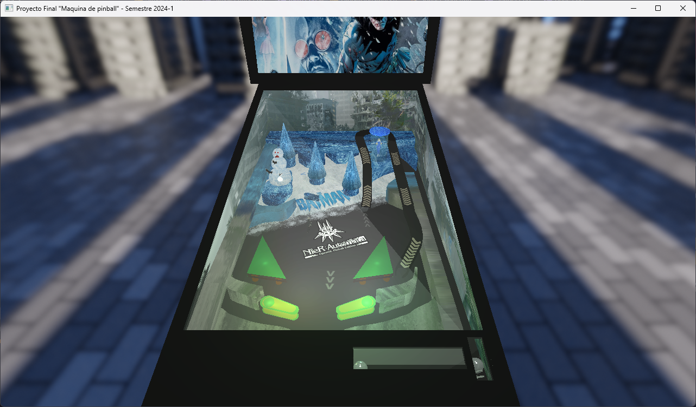
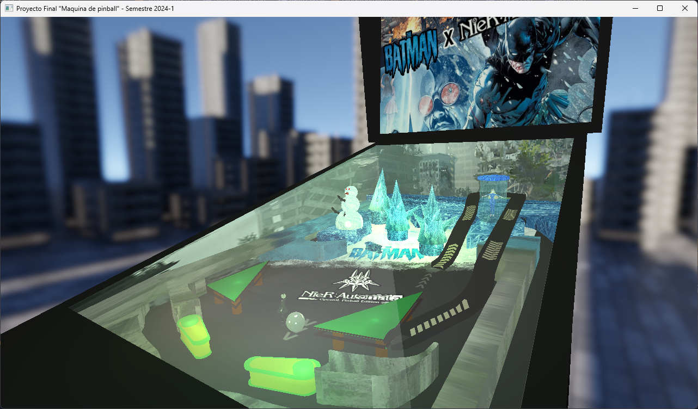
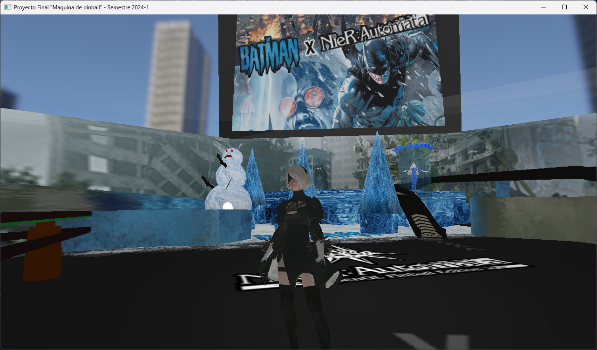

# Proyecto Final - Máquina de Pinball

Computación Gráfica e Interacción Humano-Computadora

Facultad de Ingeniería - Semestre 2024-1

# Configuración del entorno recomendado

Estas herramientas son para Windows y Linux.

- Compilador: <a href="https://github.com/llvm/llvm-project/releases/tag/llvmorg-17.0.3" href="_blank">Clang (LLVM 17)</a>
- Herramienta de compilación: <a href="https://cmake.org/download/" target="_blank">CMake</a>
- Gestor de paquetes: <a href="https://vcpkg.io/en/getting-started" target="_blank">vcpkg</a>

Instalación de paquetes de vcpkg (opcionalmente se pueden instalar las versiones x86)

    vcpkg install assimp:x64-windows glew:x64-windows glfw3:x64-windows glm:x64-windows openal-soft:x64-windows freealut:x64-windows boost-format:x64-windows
    vcpkg integrate install

Para las versiones x86

    vcpkg install assimp:x86-windows glew:x86-windows glfw3:x86-windows glm:x86-windows openal-soft:x86-windows freealut:x86-windows boost-format:x86-windows
    vcpkg integrate install

vcpkg también se puede integrar a Visual Studio para utilizarlo con MSVC.

Configuración del proyecto con CMake
    
    mkdir build
    cd build
    cmake .. -DCMAKE_TOOLCHAIN_FILE=C:/dev/vcpkg/scripts/buildsystems/vcpkg.cmake -DCMAKE_EXPORT_COMPILE_COMMANDS=ON -DCMAKE_BUILD_TYPE=Debug

De ser necesario especificar el compilador, usar el siguiente

    cmake .. -DCMAKE_TOOLCHAIN_FILE=C:/dev/vcpkg/scripts/buildsystems/vcpkg.cmake -DCMAKE_C_COMPILER="C:/Program Files/LLVM/bin/clang.exe" -DCMAKE_CXX_COMPILER="C:/Program Files/LLVM/bin/clang++.exe" -DCMAKE_EXPORT_COMPILE_COMMANDS=ON -DCMAKE_BUILD_TYPE=Debug

Nota: Con _CMAKE_EXPORT_COMPILE_COMMANDS_ se puede integrar fácilmente el proyecto a Visual Studio Code (Requiere las extensiones de CMake y vcpkg)

__Importante__: En la entrega final es __necesario__ compilar con `-DCMAKE_BUILD_TYPE=Release` 

Compilación

    cmake --build .

# Capturas del programa

# Roadmap
## Fase 1 - Base del programa
- [x] Manejo de ventanas
- [x] Entrada de teclado y mouse
- [x] Ventana de proyección
- [x] Cámara (multi instancias)
- [x] Shaders mínimos

## Fase 2 - Modelos
- [x] Carga de modelos por `Assimp`
- [x] Optimizado de la carga de modelos

## Fase 3 - Shading y texturizado
- [x] Sistema de carga / búsqueda de texturas
- [x] Pre-Sistema de shaders (para skyboxDay e iluminación)
- [x] Texturizado de los elementos en pantalla

## Fase 4 - Iluminación
- [x] Skyboxes
- [x] Sistema de iluminación (Colecciones de luces)

## Fase 5 - Animación
- [x] Animación de los elementos en el tablero
- [x] Animación del avatar

## Fase 6 - Audio
- [x] Integración de OpenAL

[//]: # (Quería poner esto en BoneModel.cpp o alguno de esos)

[//]: # (archivos, pero causaría conflicos &#40;carácteres incompatibles)
[//]: # (con C++&#41;)
[//]: # (&#40;Consideremos esto un pequeño easter egg en el repositorio&#41;)
[//]: # (⠄⠄⠄⠄⢠⣿⣿⣿⣿⣿⢻⣿⣿⣿⣿⣿⣿⣿⣿⣯⢻⣿⣿⣿⣿⣆⠄⠄⠄)
[//]: # (⠄⠄⣼⢀⣿⣿⣿⣿⣏⡏⠄⠹⣿⣿⣿⣿⣿⣿⣿⣿⣧⢻⣿⣿⣿⣿⡆⠄⠄)
[//]: # (⠄⠄⡟⣼⣿⣿⣿⣿⣿⠄⠄⠄⠈⠻⣿⣿⣿⣿⣿⣿⣿⣇⢻⣿⣿⣿⣿⠄⠄)
[//]: # (⠄⢰⠃⣿⣿⠿⣿⣿⣿⠄⠄⠄⠄⠄⠄⠙⠿⣿⣿⣿⣿⣿⠄⢿⣿⣿⣿⡄⠄)
[//]: # (⠄⢸⢠⣿⣿⣧⡙⣿⣿⡆⠄⠄⠄⠄⠄⠄⠄⠈⠛⢿⣿⣿⡇⠸⣿⡿⣸⡇⠄)
[//]: # (⠄⠈⡆⣿⣿⣿⣿⣦⡙⠳⠄⠄⠄⠄⠄⠄⢀⣠⣤⣀⣈⠙⠃⠄⠿⢇⣿⡇⠄)
[//]: # (⠄⠄⡇⢿⣿⣿⣿⣿⡇⠄⠄⠄⠄⠄⣠⣶⣿⣿⣿⣿⣿⣿⣷⣆⡀⣼⣿⡇⠄)
[//]: # (⠄⠄⢹⡘⣿⣿⣿⢿⣷⡀⠄⢀⣴⣾⣟⠉⠉⠉⠉⣽⣿⣿⣿⣿⠇⢹⣿⠃⠄)
[//]: # (⠄⠄⠄⢷⡘⢿⣿⣎⢻⣷⠰⣿⣿⣿⣿⣦⣀⣀⣴⣿⣿⣿⠟⢫⡾⢸⡟⠄.)
[//]: # (⠄⠄⠄⠄⠻⣦⡙⠿⣧⠙⢷⠙⠻⠿⢿⡿⠿⠿⠛⠋⠉⠄⠂⠘⠁⠞⠄⠄⠄)
[//]: # (⠄⠄⠄⠄⠄⠈⠙⠑⣠⣤⣴⡖⠄⠿⣋⣉⣉⡁⠄⢾⣦⠄⠄⠄⠄⠄⠄⠄⠄)